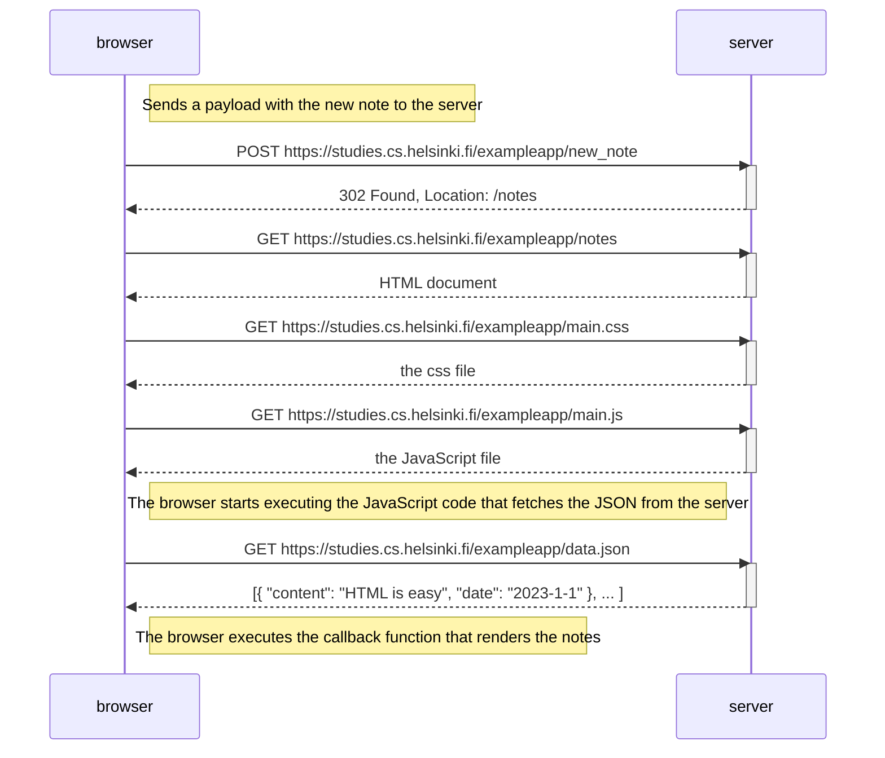
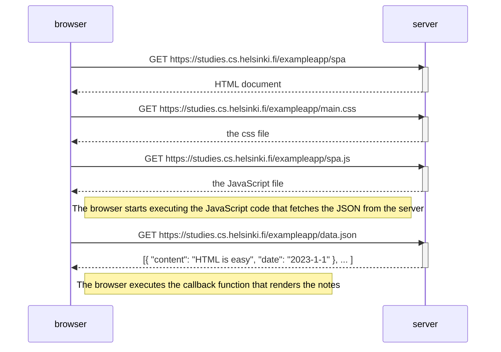
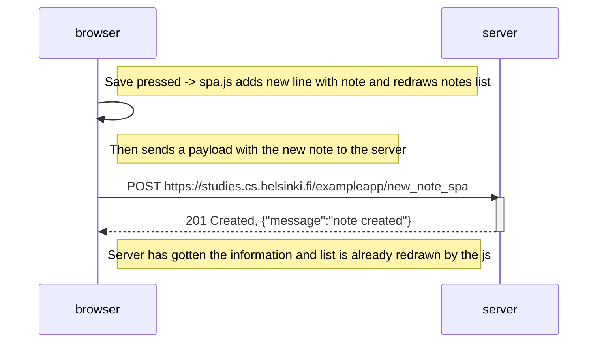

## Exercise 0.4: When posting a new note
The note is posted to the server, causing a 302 response. This results in the whole page being reloaded

---

## Exercise 0.5: SPA loading
The sequence is almost the same compared to the more traditional page but just gets the 'spa' files required for the functionality

---

## Exercise 0.6: SPA new note
